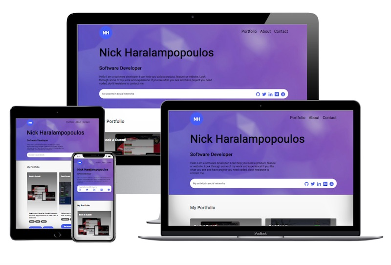

# My Portfolio Page

The source code of my portfolio page

## Screenshot

## Technologies Used

- HTML
- CSS

## Live version

- [Nick Haralampopoulos portfolio](https://nickharas.com)

## Acknowledgements

- [Microverse](https://www.microverse.org) software development school

## 👤 Author

## Nick Haralampopoulos

- Github: [@macnick](https://github.com/macnick)
- Twitter: [@mac_experts](https://twitter.com/mac_experts)
- Linkedin: [Nick Haralampopoulos](https://www.linkedin.com/in/nick-haralampopoulos/)
- AngelList: [Nick Haralampopoulos](https://angel.co/u/nick-haralampopoulos)

## 🤝 Contributing

Contributions, issues and feature requests are welcome!

Feel free to check the [issues page](https://github.com/macnick/portfolio/issues).

## Show your support

Give a ⭐️ if you enjoyed this project!

## 📝 License

This project is [MIT](lic.url) licensed.
